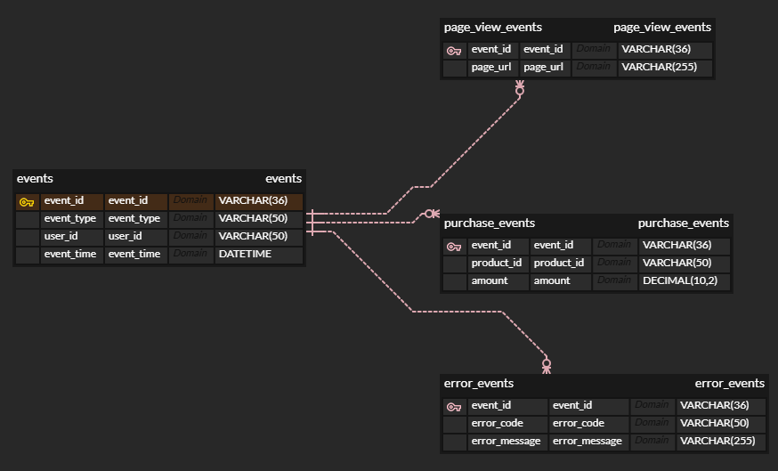
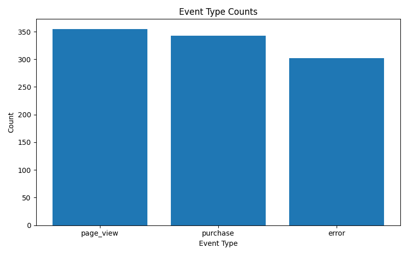
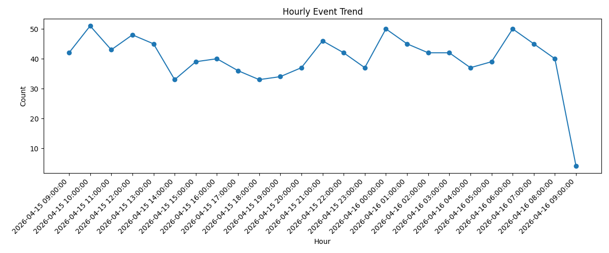

# EVENT LOG PIPELINE

## 1. 프로젝트 개요
이 프로젝트는 웹 서비스에서 발생할 수 있는 이벤트 로그를 **생성 → 저장 → 분석 → 시각화**하는 간단한 데이터 파이프라인입니다.

- 이벤트를 직접 설계하고 랜덤하게 생성할 것
- 이벤트를 JSON 통저장이 아니라 **필드 단위로 구조화해 저장**할 것
- 저장된 데이터를 SQL로 집계 분석할 것
- `docker compose up` 한 번으로 재현 가능할 것
- 결과를 이미지 파일로 확인할 수 있을 것

---

## 2. 전체 구조

```text
Event Generator (Python)
        ↓
 MySQL (Structured Storage)
        ↓
 SQL Aggregation
        ↓
 Visualization (matplotlib)
        ↓
 PNG Output
```

- `app` 컨테이너: 이벤트 생성, 저장, 분석, 시각화 수행
- `db` 컨테이너: MySQL 실행 및 스키마 초기화

실행은 `docker compose up --build` 한 번으로 가능하도록 구성했습니다.

---

## 3. 기술 선택 이유

### Python
이벤트 생성, 데이터 적재, 분석, 시각화까지 하나의 언어로 빠르게 구현할 수 있어 선택했습니다. 과제 제한 시간 안에 전체 파이프라인을 끝까지 완성하기에 적합하다고 판단했습니다.

### MySQL
이벤트를 JSON 형태로 통째로 저장하지 않고, **필드 단위로 나눠 저장**한 뒤 SQL 기반 집계 분석을 수행하기 위해 관계형 DB를 선택했습니다. MySQL은 구조를 명확하게 보여주기 쉽고 Docker Compose로 재현하기도 쉬워 과제 목적에 잘 맞는다고 판단했습니다.

### Docker Compose
앱과 DB를 한 번에 실행해 동일한 환경에서 쉽게 재현할 수 있도록 하기 위해 사용했습니다. `docker compose up` 한 번으로 전체 스택을 실행하라는 과제 요구사항과도 직접적으로 맞닿아 있습니다.

### matplotlib
별도 BI 도구 없이도 SQL 집계 결과를 차트 이미지 파일로 저장할 수 있어 선택했습니다. 과제 범위에서 결과물을 명확하게 보여주기에 적합했습니다.

---

## 4. 이벤트 설계
본 프로젝트에서는 웹 서비스에서 자주 발생할 수 있는 대표 이벤트로 아래 3가지를 설계했습니다.

### 1) `page_view`
사용자가 특정 페이지를 조회한 이벤트입니다. 서비스 이용 흐름과 페이지 접근 패턴을 파악하기 위한 가장 기본적인 행동 로그입니다.

### 2) `purchase`
사용자가 상품을 구매한 이벤트입니다. 단순 행동 로그를 넘어, 서비스의 비즈니스 성과와 직접 연결되는 이벤트를 포함하고자 했습니다.

### 3) `error`
서비스 이용 중 오류가 발생한 이벤트입니다. 이벤트 로그 파이프라인이 단순 사용량 분석에만 머무르지 않고, 운영 안정성 관점의 지표도 다룰 수 있도록 포함했습니다.

### 왜 이렇게 설계했는가
작은 과제 안에서도 아래 세 가지 관점을 함께 보여주고 싶었습니다.

- **행동 데이터**: `page_view`
- **비즈니스 데이터**: `purchase`
- **운영/장애 데이터**: `error`

즉, 단순 랜덤 로그 생성이 아니라 **서비스 사용 흐름, 매출 이벤트, 안정성 이벤트를 함께 다룰 수 있는 구조**로 설계했습니다.

---

## 5. 저장소 선택 이유
저장소는 **MySQL**을 선택했습니다.

선택 이유는 다음과 같습니다.

1. 이벤트를 JSON 통저장하지 않고 **필드 단위로 구조화해 저장**해야 했습니다.
2. 이후 **이벤트 타입별 발생 횟수, 유저별 총 이벤트 수, 시간대별 이벤트 추이, 에러 이벤트 비율**과 같은 SQL 집계를 수행해야 했습니다.
3. README에서 저장 구조를 명확하게 설명할 수 있어야 했습니다.
4. Docker Compose 환경에서 실행과 재현이 쉬운 구성이 필요했습니다.

과제 규모에서는 파일 저장이나 문서형 저장소보다, **정형 스키마 + SQL 분석**이 더 핵심이라고 판단해 MySQL을 선택했습니다.

---

## 6. 스키마
이벤트는 공통 정보와 상세 정보를 분리해 저장했습니다.

### ERD


### 6.1 `events`
모든 이벤트가 공통으로 가지는 메타데이터를 저장하는 테이블입니다.

| Column | Type | Description |
|---|---|---|
| event_id | VARCHAR(36) | 이벤트 고유 ID |
| event_type | VARCHAR(50) | 이벤트 유형 (`page_view`, `purchase`, `error`) |
| user_id | VARCHAR(50) | 사용자 ID |
| event_time | DATETIME | 이벤트 발생 시각 |

### 6.2 `page_view_events`
`page_view` 이벤트의 상세 정보를 저장합니다.

| Column | Type | Description |
|---|---|---|
| event_id | VARCHAR(36) | `events.event_id` 참조 |
| page_url | VARCHAR(255) | 조회한 페이지 URL |

### 6.3 `purchase_events`
`purchase` 이벤트의 상세 정보를 저장합니다.

| Column | Type | Description |
|---|---|---|
| event_id | VARCHAR(36) | `events.event_id` 참조 |
| product_id | VARCHAR(50) | 구매 상품 ID |
| amount | DECIMAL(10,2) | 구매 금액 |

### 6.4 `error_events`
`error` 이벤트의 상세 정보를 저장합니다.

| Column | Type | Description |
|---|---|---|
| event_id | VARCHAR(36) | `events.event_id` 참조 |
| error_code | VARCHAR(50) | 오류 코드 |
| error_message | VARCHAR(255) | 오류 메시지 |

### 스키마 설명
초기에는 모든 이벤트를 하나의 테이블에 저장하는 방식도 고려했습니다. 하지만 이벤트 타입별 속성이 달라 단일 테이블로 구성하면 불필요한 NULL 컬럼이 많아지고, 저장 구조의 의미도 흐려질 수 있다고 판단했습니다.

그래서 공통 이벤트 정보는 `events`에 저장하고, 이벤트 유형별 상세 정보는 별도 테이블로 분리했습니다. 이를 통해 공통 속성과 상세 속성을 명확히 구분하고, 필드 단위 저장이라는 과제 요구사항을 더 분명하게 만족하도록 설계했습니다.

---

## 7. 프로젝트 구조

```bash
EVENT-LOG-PIPELINE/
├─ app/
│  ├─ main.py
│  ├─ generator.py
│  ├─ db.py
│  ├─ analyze.py
│  └─ visualize.py
├─ sql/
│  └─ schema.sql
├─ output/
├─ docs/
│  ├─ event_type_counts.png
│  └─ hourly_event_trend.png
├─ Dockerfile
├─ docker-compose.yml
├─ requirements.txt
└─ README.md
```

### 파일 역할
- `generator.py`: 랜덤 이벤트 생성
- `db.py`: MySQL 연결 및 이벤트 저장
- `analyze.py`: SQL 집계 수행
- `visualize.py`: 집계 결과 차트 생성
- `main.py`: 전체 파이프라인 실행 시작점
- `schema.sql`: DB 스키마 정의
- `docker-compose.yml`: 앱 + DB 통합 실행
- `Dockerfile`: 앱 실행 환경 정의

---

## 8. 실행 방법

### 8.1 필요한 도구
아래 도구가 설치되어 있어야 합니다.

- Docker
- Docker Compose
- Git

### 8.2 설치 및 실행
```bash
git clone https://github.com/<your-id>/EVENT-LOG-PIPELINE.git
cd EVENT-LOG-PIPELINE
docker compose up --build
```

### 8.3 실행 후 자동으로 수행되는 작업
1. MySQL 컨테이너 실행
2. 스키마 초기화
3. 이벤트 생성
4. 이벤트 저장
5. SQL 집계 분석
6. 차트 이미지 생성

### 8.4 결과 확인
실행이 완료되면 아래 파일이 생성됩니다.

- `output/event_type_counts.png`
- `output/hourly_event_trend.png`

---

## 9. 데이터 집계 분석
과제 요구사항에 맞춰 저장된 데이터를 SQL로 집계 분석했습니다.

### 9.1 이벤트 타입별 발생 횟수
이벤트 타입별 발생 횟수를 확인해 전체 분포를 파악합니다.

```sql
SELECT event_type, COUNT(*) AS count
FROM events
GROUP BY event_type
ORDER BY count DESC;
```

### 9.2 유저별 총 이벤트 수
유저별 총 이벤트 수를 확인해 활동량 차이를 파악합니다.

```sql
SELECT user_id, COUNT(*) AS total_events
FROM events
GROUP BY user_id
ORDER BY total_events DESC;
```

### 9.3 시간대별 이벤트 추이
시간대별 이벤트 추이를 확인해 시간 흐름에 따른 패턴을 파악합니다.

```sql
SELECT DATE_FORMAT(event_time, '%Y-%m-%d %H:00:00') AS event_hour, COUNT(*) AS count
FROM events
GROUP BY event_hour
ORDER BY event_hour;
```

### 9.4 에러 이벤트 비율
전체 이벤트 대비 에러 이벤트의 비율을 확인해 안정성 지표로 활용합니다.

```sql
SELECT ROUND(
    100.0 * SUM(CASE WHEN event_type = 'error' THEN 1 ELSE 0 END) / COUNT(*),
    2
) AS error_ratio_percent
FROM events;
```

### 왜 이 분석을 선택했는가
분석 항목은 단순한 건수 확인에 그치지 않고, **서비스 사용 패턴과 안정성**을 함께 볼 수 있도록 구성했습니다.

- 이벤트 타입별 분포
- 사용자별 활동량
- 시간 기반 패턴
- 운영 안정성 지표

를 함께 확인할 수 있도록 설계했습니다.

---

## 10. 시각화
### 10.1 Event Type Counts
이벤트 타입별 발생 횟수를 막대그래프로 시각화했습니다.



### 10.2 Hourly Event Trend
시간대별 이벤트 추이를 선그래프로 시각화했습니다.



---

## 11. 구현하면서 고민한 점
구현 과정에서 가장 고민한 부분은 아래와 같습니다.

### 11.1 단일 테이블 vs 분리 테이블
초기에는 모든 이벤트를 하나의 `events` 테이블에 저장하는 구조도 고려했습니다. 이 방식은 구현은 단순하지만, 이벤트 타입별 속성이 달라질수록 불필요한 NULL 컬럼이 많아지고 스키마 의미가 흐려질 수 있다고 판단했습니다.

그래서 공통 이벤트 메타데이터는 `events`에 두고, 상세 속성은 이벤트별 테이블로 분리했습니다. 과제 규모를 과하게 복잡하게 만들지 않으면서도, 데이터 구조를 더 명확하게 보여주는 방향을 선택했습니다.

### 11.2 왜 파일 저장이 아니라 MySQL인가
파일 기반 저장도 가능했지만, 이 과제는 저장 이후 SQL 집계와 시각화가 중요했습니다. 따라서 정형 스키마를 가지고 SQL 분석을 수행하기 쉬운 관계형 DB가 더 적합하다고 판단했습니다.

### 11.3 Docker Compose에서 DB 준비 상태 문제
Docker Compose에서는 DB 컨테이너가 먼저 시작되더라도, 실제로는 연결 가능한 상태가 아닐 수 있습니다. 이 문제를 해결하기 위해 앱 시작 시 DB 연결 재시도 로직을 넣어 실행 안정성을 높였습니다.

### 11.4 분석 범위 결정
최소 2개의 분석만 해도 요구사항은 만족하지만, 서비스 사용량과 안정성을 함께 보여주는 것이 더 좋다고 판단해 4개의 분석 항목으로 확장했습니다.

---

## 12. 선택 과제 A - Kubernetes 기초 이해

### 12.1 1) Kubernetes manifest 파일 작성

- `k8s/deployment.yaml`
- `k8s/configmap.yaml`
- `k8s/secret.yaml`
- `k8s/service.yaml`


#### `k8s/deployment.yaml`
```yaml
apiVersion: apps/v1
kind: Deployment
metadata:
  name: event-generator
spec:
  replicas: 1
  selector:
    matchLabels:
      app: event-generator
  template:
    metadata:
      labels:
        app: event-generator
    spec:
      containers:
        - name: event-generator
          image: your-dockerhub-or-ecr-repo/event-log-pipeline:latest
          ports:
            - containerPort: 8000
          env:
            - name: DB_HOST
              valueFrom:
                configMapKeyRef:
                  name: event-generator-config
                  key: DB_HOST
            - name: DB_NAME
              valueFrom:
                configMapKeyRef:
                  name: event-generator-config
                  key: DB_NAME
            - name: EVENT_COUNT
              valueFrom:
                configMapKeyRef:
                  name: event-generator-config
                  key: EVENT_COUNT
            - name: DB_USER
              valueFrom:
                secretKeyRef:
                  name: event-generator-secret
                  key: DB_USER
            - name: DB_PASSWORD
              valueFrom:
                secretKeyRef:
                  name: event-generator-secret
                  key: DB_PASSWORD
```

#### `k8s/configmap.yaml`
```yaml
apiVersion: v1
kind: ConfigMap
metadata:
  name: event-generator-config
data:
  DB_HOST: mysql-service
  DB_NAME: event_pipeline
  EVENT_COUNT: "1000"
```

#### `k8s/secret.yaml`
```yaml
apiVersion: v1
kind: Secret
metadata:
  name: event-generator-secret
type: Opaque
stringData:
  DB_USER: root
  DB_PASSWORD: root
```

#### `k8s/service.yaml`
```yaml
apiVersion: v1
kind: Service
metadata:
  name: event-generator-service
spec:
  selector:
    app: event-generator
  ports:
    - protocol: TCP
      port: 80
      targetPort: 8000
  type: ClusterIP
```

### 12.2 2) README에 선택한 Kubernetes 리소스의 역할 설명

#### Deployment의 역할
Deployment는 이벤트 생성기 앱 컨테이너를 실행하고, 원하는 파드 수를 유지하며, 재시작과 업데이트 같은 기본적인 워크로드 관리를 담당합니다.

#### ConfigMap의 역할
ConfigMap은 이벤트 생성 개수, DB host, DB name 같은 **비민감 설정값**을 이미지나 코드와 분리해 관리하는 역할을 합니다.

#### Secret의 역할
Secret은 DB 계정이나 비밀번호처럼 **민감한 정보**를 일반 설정값과 분리해 저장하고 참조하는 역할을 합니다.

#### Service의 역할
Service는 파드가 재생성되어 IP가 바뀌더라도, Kubernetes 내부에서 안정적인 이름으로 접근할 수 있는 네트워크 진입점을 제공합니다.

### 12.3 Kubernetes 리소스를 선택한 이유

#### 왜 Deployment를 선택했는가
이 앱은 컨테이너 기반으로 동작하므로, Kubernetes에서 가장 기본적인 워크로드 리소스인 Deployment가 적합하다고 판단했습니다. 단순 Pod보다 선언적으로 원하는 상태를 유지할 수 있어 설명하기도 좋습니다. 또한, Replicas 설정을 통해 Pod 수 유지가 좋습니다.

#### 왜 ConfigMap을 선택했는가
설정값을 이미지와 분리하면 동일한 이미지를 환경별로 재사용할 수 있습니다. 과제 규모는 작지만, 설정을 코드와 분리하는 방식이 더 운영 친화적이라고 판단했습니다.

#### 왜 Secret을 선택했는가
비밀번호 같은 정보를 코드나 이미지에 직접 넣지 않는 것이 더 바람직하다고 생각했습니다. 실제 운영에서는 자격 증명 분리가 중요하므로, 과제에서도 이를 반영하고자 했습니다.

#### 왜 Service를 선택했는가
Kubernetes에서는 파드가 고정된 IP를 보장하지 않기 때문에, 안정적인 접근 지점을 제공하는 Service가 필요합니다. 단순 배포를 넘어서 네트워크 관점까지 보여주기 위해 포함했습니다.

### 12.4 정리

- **앱 실행**: Deployment
- **설정 분리**: ConfigMap
- **민감정보 분리**: Secret
- **안정적인 접근 지점 제공**: Service

---
